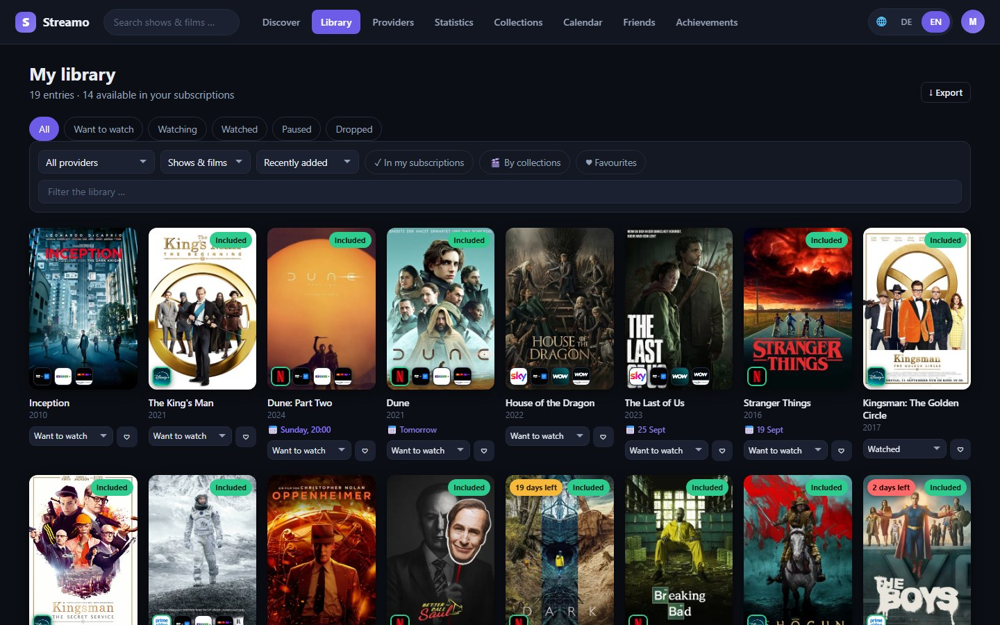
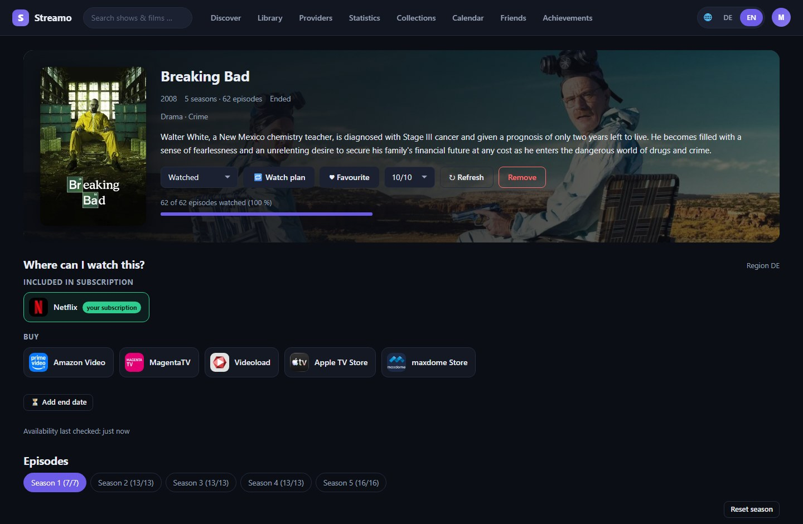
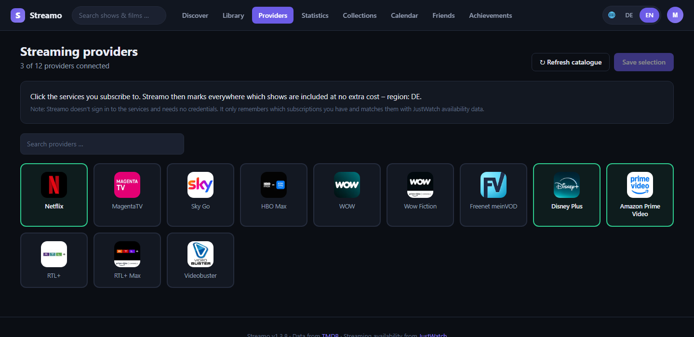
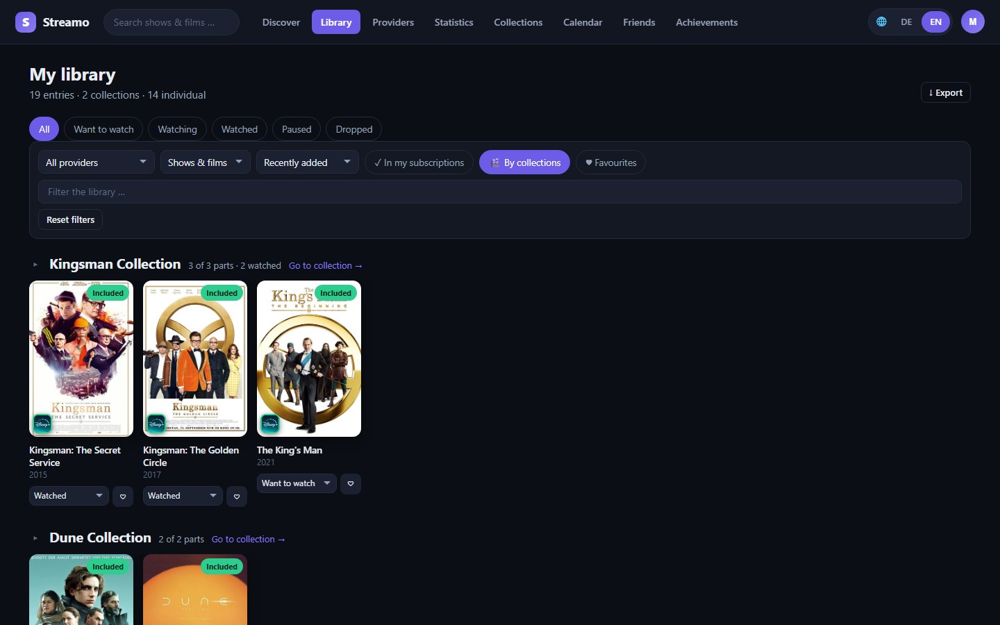
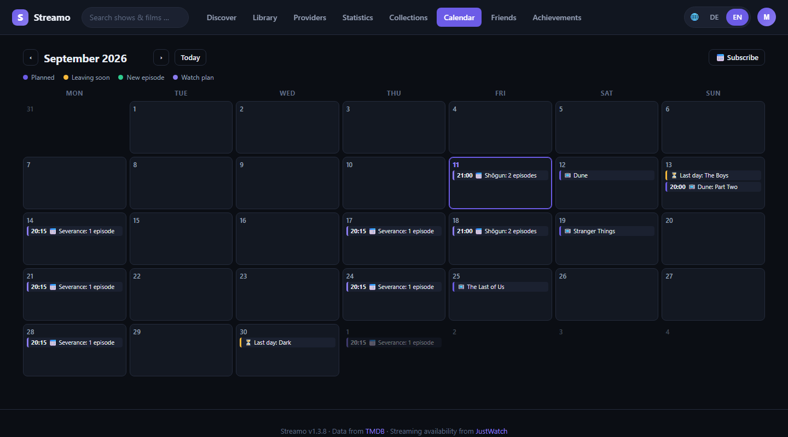
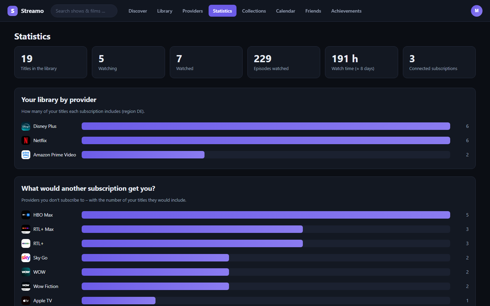
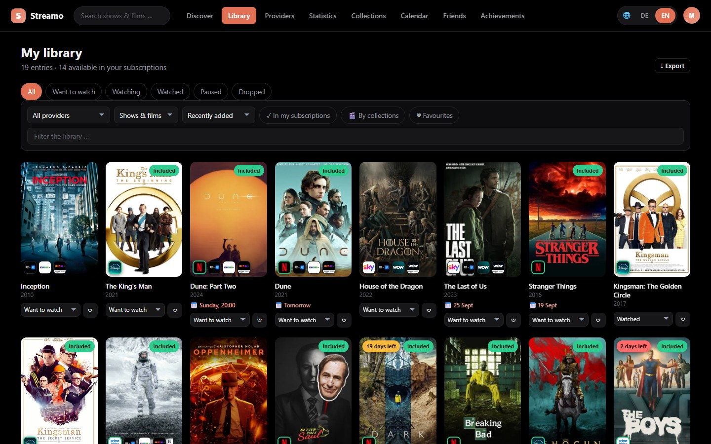
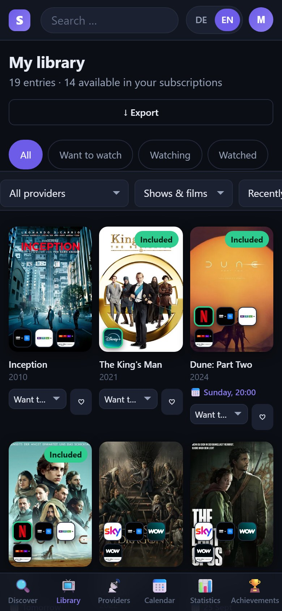
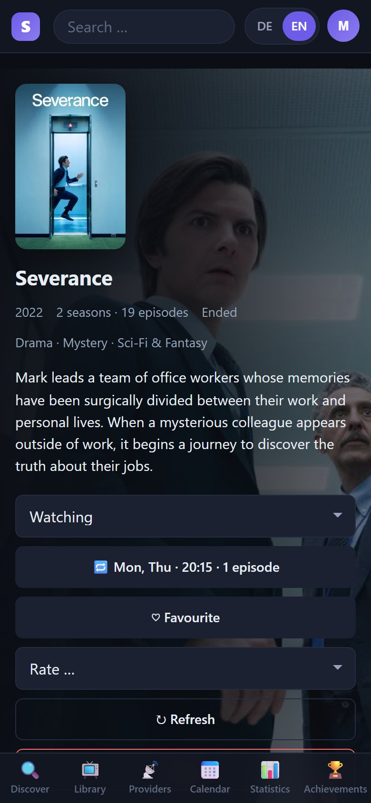
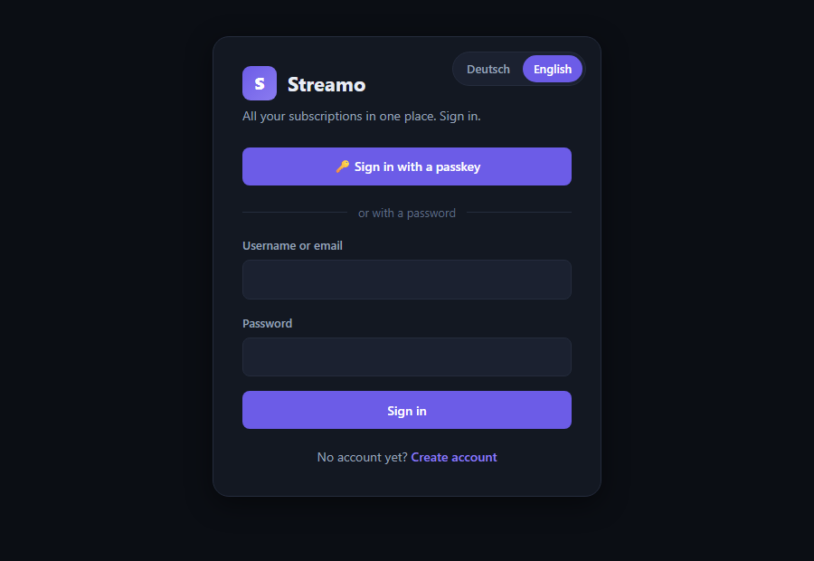

<div align="center">


# Streamo

**All your streaming subscriptions in one place.**

Your own self-hosted database of shows and films –<br>
with one glance at **where** every title streams and whether it's **in your subscription**.

[](https://github.com/MoinMornhart/Streamo/commits/main)
[](LICENSE)
[](https://nodejs.org/)
[](#installation)
[](https://github.com/MoinMornhart/Streamo/releases)

**[Deutsch](README.md)** · English

[Installation](#installation) · [Features](#what-streamo-does) · [On your phone](#on-your-phone) · [Signing in](#signing-in--password-passkey-two-factor) · [Configuration](#configuration) · [Updating](#updating)

<br>



<sub>All screenshots show a demo instance with sample data.</sub>

</div>

---

## At a glance

|  |  |
| --- | --- |
| 📺 **Where is it on?** | Provider logos on every title, outlined in green when your subscription already covers it |
| 📚 **Your library** | Watchlist, per-episode progress, ratings, favourites, collections |
| 🗓️ **Calendar** | Plans, watch plans, titles leaving soon – also as a subscription for Apple and Google Calendar |
| 📊 **Statistics** | Which subscription pays off and which one you could cancel |
| 👥 **Several people** | Own subscriptions and lists per person, friends, shared suggestions |
| 🔐 **Secure sign-in** | Password, passkey, two-factor with an authenticator app |
| 🌍 **German or English** | Each person picks the interface language, independent of the content language |
| 🏠 **Runs at home** | One command on Proxmox or a Raspberry Pi, no credentials for third-party services |

---

## Installation

> [!NOTE]
> The detailed guides linked below ([QUICKSTART](docs/QUICKSTART.md), [Raspberry Pi](docs/RASPBERRY-PI.md)) are written in German. The commands in them work the same regardless of language.

### Proxmox – one command

In the **shell of your Proxmox host**. It creates an LXC container, installs everything and tells you the address at the end:

```bash
bash -c "$(curl -fsSL https://raw.githubusercontent.com/MoinMornhart/Streamo/main/scripts/streamo.sh)"
```

After two to four minutes Streamo runs at `http://<container-ip>:3000`. The detailed guide with every option is in **[docs/QUICKSTART.md](docs/QUICKSTART.md)**.

<details>
<summary><b>Container defaults</b></summary>

<br>

| Setting | Value |
| --- | --- |
| Operating system | Debian 13 (LXC, unprivileged) |
| CPU | 2 cores |
| Memory | 2048 MB |
| Disk | 8 GB |
| Network | DHCP on `vmbr0` |
| Port | 3000 |
| Autostart | yes |

All values can be changed under "Advanced" in the installation dialog.

</details>

### Raspberry Pi and other Linux machines

It doesn't have to be Proxmox. The same installer runs on any Debian or Ubuntu system – including Raspberry Pi OS:

```bash
sudo bash -c "$(curl -fsSL https://raw.githubusercontent.com/MoinMornhart/Streamo/main/scripts/install/streamo-install.sh)"
```

Afterwards Streamo runs at `http://<address>:3000`, with the same commands (`update`, `streamo status`, …) as in the container. It installs Node.js, creates its own service user and sets up a systemd service.

> [!TIP]
> **Use the 64-bit version on the Pi.** Streamo needs Node.js 22.13 or newer for the built-in `node:sqlite`; on 32-bit systems the Node line ends at 22, on 64-bit there is 24. The installer picks the right one by itself and stops with a clear message on an architecture without packages, instead of failing later with a cryptic `apt` error.

The detailed guide including SD card backup, storage needs and troubleshooting is in **[docs/RASPBERRY-PI.md](docs/RASPBERRY-PI.md)**.

### By hand

Requirement: **Node.js 22.13 or newer** (for the built-in `node:sqlite` module; Node 24 LTS is recommended).

```bash
git clone https://github.com/MoinMornhart/Streamo.git
cd Streamo
npm install --omit=dev
cp .env.example .env      # optional, works without it too
npm start
```

Streamo then runs at <http://localhost:3000>. On first visit a wizard walks you through the setup.

### Windows app

Besides the web interface there is an app for your PC: **[Download the installer](https://github.com/MoinMornhart/Streamo/releases)**

It shows the same interface in its own window and adds what a browser can't: keep running in the notification area, notify you about new episodes, start with Windows and open the search with `Ctrl`+`Shift`+`S`. Its menus follow the language of your system. Details in [desktop/README.md](desktop/README.md).

The app keeps itself up to date: it checks shortly after starting and every four hours afterwards, downloads in the background and then asks whether to restart. If you decline, the update is installed the next time you quit. On start it also clears its cache once – otherwise it could still show the old interface after a server update.

> [!NOTE]
> The download page only ever lists the newest version; the build workflow removes older ones. That doesn't matter for self-updating – it always reads the newest one anyway.

### The TMDB key

Streamo gets titles, images and availability through the free TMDB API. For that you need a key **once**: [themoviedb.org/settings/api](https://www.themoviedb.org/settings/api) → create an account → request an API key (purpose "Personal / Education" is enough) → copy the key. Both the *API Read Access Token* and the classic *API Key* work. You enter it during setup or later under *Settings* – it then applies to the whole instance; people you invite don't need their own.

---

## What Streamo does

### Always see where it's on

Every tile shows the provider logos right on the poster. Outlined in green means: included in your subscription. The detail page has the full list, split into subscription, free, rent and buy. Clicking a provider takes you **straight to it** – Netflix, Prime Video, Disney+ and a dozen or so more, with the search for the title already filled in. Only unknown providers go through JustWatch.



### Connect providers

Click the services you subscribe to – Netflix, Disney+, Prime Video, WOW, Paramount+, Apple TV+, MagentaTV and more than a hundred others, depending on the region. Streamo then knows what you can watch at no extra cost. Plan variants like "Netflix Standard with Ads" or "Paramount+ Amazon Channel" are merged into one service instead of making you pick between three Netflix tiles.



### Your show database

Search for shows and films and add them to your list. Five states (*Want to watch, Watching, Watched, Paused, Dropped*), your own rating, favourites and notes.

**Episode progress** – tick off seasons and episodes, one at a time, a whole season or "everything up to here". The status switches automatically from *Want to watch* to *Watching* and at the end to *Watched*.

**A date, if you like** – on the watchlist you can set a day for any title – Friday night, the weekend, when the final season comes out. Optional: without a date the list behaves as before. The tile then says *"Tomorrow"* or *"Friday"*, afterwards *"overdue"*, and the library can be sorted by *Planned date*. A long watchlist turns into an order instead of a graveyard of good intentions. Add a time and it becomes a proper appointment in the calendar: for a film it ends after the film's runtime, for a show after one episode.

**Leaving soon** – if it's known until when a title stays on a provider, the tile says so: *"5 days left"*, in red for the last three days. Skimming the library shows you what should come up this week.

> [!NOTE]
> This information does **not** come from TMDB. Its API returns exactly four fields per provider – logo, ID, name and sort rank – and no end date in any form. It's only known when someone enters it, for instance from a "last day" notice on the provider. The detail page has *Add end date* for that; the entry then applies to everyone on the instance, because when a title leaves a platform is a fact about the platform. Once the day has passed and the title is still there, the note disappears by itself – a silent false alarm would be worse than no information at all.

### Collections you can expand and collapse

In the library, titles can be grouped by collection. Collapsed, an eight-part collection takes one row: three tiles side by side, an arrow on the right pages on. Expanded, everything is shown at once. The browser remembers which collections are open – just like the filters you used last.



**Share lists** – every collection – your own as well as the official ones from TMDB – can be passed on via a link, through WhatsApp, Telegram, email or simply copied. Whoever opens the link sees the list without an account and without signing in. What the creator has watched and which subscriptions they have is not shown.

### Calendar – in your own one too

A tab with a month grid showing **every** day – including the empty ones. That's what makes a calendar: you see not just what's coming up, but also when nothing is. It shows what you've planned, your watch plans, what's about to leave a platform and when new episodes air.



All of it can be subscribed to – Apple Calendar, Google Calendar, Thunderbird. Set it up once and it keeps itself up to date, in the language of your account. On a Mac or iPhone one click on *Subscribe now* is enough; elsewhere you copy the address into your calendar app.

> [!IMPORTANT]
> The address is the only proof – a calendar app can't sign in. That makes it as sensitive as a password. You can create a new one at any time, which makes old subscriptions stop working.

### Watch plan – two episodes every Monday

That's how people actually watch shows: not at some point, but in a rhythm. Set on which days you watch a show and how many episodes – Streamo ticks them off by itself on those days.

The plan does **not** remember where it is; it always takes the next unwatched episodes. If you spontaneously watch five episodes one evening and tick them off by hand, next Monday you won't get the same ones again – the plan continues from where you are. Specials and episodes that haven't aired yet are left out.

If the server was off on a plan day, it catches up – capped at three dates, so you don't come back from holiday to half a season marked as watched. Upcoming dates are in the calendar.

**With a time** – if you like, add when you watch: "Mondays at 8:15 pm". Every session then appears in the calendar with a start and an end, including the subscribed one. Streamo works out how long it takes from the runtimes of exactly the episodes that are up next – two 50-minute episodes make 20:15 to 21:55, and an evening with the season finale gets longer accordingly. Episodes are then ticked off only once the session is over.

### Statistics that answer a question

How are your shows spread across your subscriptions? Which service has nothing from your list (a candidate for cancelling)? Which additional subscription would unlock the most for you? And how much of your life have you actually spent on this?



### Discover instead of search

The start page shows two charts: the **top films of the week** – what's being watched most right now – and the **top films of the year**, sorted by rating and from 500 votes up, so no fluke with four ratings ends up on top. Provider logos on the tiles show where a title streams and whether one of your subscriptions includes it.

**For you – recommendations from your own library.** Above the popular titles there's a row that looks different for every person. It comes from what you've watched yourself: a 10 out of 10 counts more than a 6, a favourite more than something on the side, a finished show more than one you've just started. What's on your watchlist doesn't count – you haven't seen it yet; the same goes for dropped and poorly rated titles. Every tile says why it's there: *"Because you watched Breaking Bad."*

**Search that forgives typos.** "Kingsmann" finds *Kingsman*, "Braking Bad" finds *Breaking Bad*, "spiderman" finds *Spider-Man*. Umlauts and accents don't matter. If TMDB returns nothing, Streamo tries again with cleaned-up spellings and tells you what it actually searched for.

### Automatic sync

Streamo checks **every hour** where your shows are streaming now. Streaming rights move all the time – you notice without having to look. Only titles that are actually in a library get synced; with 300 titles that's about 20 seconds of work per run. You set the interval under *Settings → Sync*, from hourly to "never" – the change applies right away, no restart needed.

### Several people and friends

Optional. Everyone has their own subscriptions, library, progress and region. Whoever invites them sees under *Settings → Users* who has an account, when they were last around and whether someone is signed in right now – and can grant admin rights or delete an account there.

> [!WARNING]
> Deleting removes everything attached to the account: library, watch progress, subscriptions, ratings, achievements, passkeys, friendships and own collections. That's why the username has to be typed to confirm. Invitations already sent stay valid – they belong to the instance, not the person. Your own account and the last administrator can't be deleted.

**Friends** – look at each other's lists and let Streamo work out what you can watch *together*: based on both your subscriptions and what you've planned. Plus recommendations with a one-line reason – that's the difference between "watch this" and a bare link.

### German or English

Each person chooses the interface language under *Settings → Account* – menus, buttons, messages and the calendar subscription follow it on every device. Switching takes one click: the header shows **🌐 DE | EN** next to your account circle, on every page and on phones too – and the sign-in screen has the same switch in its top right corner. The *content language* is separate: an English interface with German show titles and descriptions is perfectly possible.

### Your colour scheme

Streamo was violet because someone had to decide on violet at some point. Everyone picks their own accent colour – eight presets or a free colour picker – plus a base tone: dark blue or true black. The setting belongs to your account, not the whole instance, and travels with you to your other devices.



---

## On your phone

The same interface, made for phones: the tabs move to a bar at the bottom, controls are big enough for a thumb, and iOS no longer zooms into input fields when you tap them. Added to the home screen, Streamo looks like an app.

<p align="center">
  
  &nbsp;&nbsp;&nbsp;
  
</p>

---

## Where does the data come from?

Streamo does **not** sign in to Netflix, Disney+ and the like and needs **no credentials** for third-party services. Such APIs aren't publicly available, and other providers' passwords don't belong in a self-hosted application.

Instead:

1. You record **which subscriptions you have** (one click per service).
2. Streamo fetches **availability data from JustWatch** – through the free TMDB API. That's the same source the big comparison sites use.
3. Both are matched: for every title you see where it streams and whether *your* subscription includes it.

Same result, without handing over passwords.

---

## Signing in – password, passkey, two-factor



Three ways that coexist:

| Way | With |
| --- | --- |
| Username + password | always works, everywhere |
| Email + password | the email is optional, just a second sign-in name |
| **Passkey** | Windows Hello, Face ID, fingerprint or security key |

With a passkey, a key pair is created on your device. The private part never leaves it – Streamo only stores the public part. Even someone who steals the entire database can't sign in with it.

Passkeys are set up under *Settings → Passkeys*. You can add several (computer, phone, security key) and then optionally remove the password – Streamo only allows that as long as at least one passkey remains.

<br clear="right">

> [!NOTE]
> **Streamo sends no emails** and needs no mail server. The address is purely a second sign-in name.

### Creating an account

| Way | When |
| --- | --- |
| Setup wizard | once, on the very first start – this account becomes administrator |
| Invitation **link** | just open it, enter name and password, done |
| *Create account* on the sign-in screen | with the invitation **code**, or without one if registration is open |

Whether a code is needed is up to the instance. By default yes – see [Configuration](#configuration). You can switch it under *Settings → Invite friends* or with `streamo registration offen`.

People you invite need **no TMDB access of their own**: it applies to the whole instance and is already set up. That's exactly why invitations exist – otherwise everyone would first have to sign up with a film database and hand over their address there.

### Two-factor sign-in

In addition to the password, a six-digit code from an authenticator app – Aegis, 2FAS, Google Authenticator or anything that speaks TOTP. Even someone who knows your password can't get into your account.

Streamo sends nothing and fetches nothing for this. Server and app share a secret during setup and then independently calculate the same thing – it even works in flight mode. The method is TOTP per RFC 6238; the implementation in `src/totp.js` is checked against the standard's official test vectors (`npm run test:totp`).

It's set up under *Settings → Two-factor sign-in*, in two steps: first the app receives the secret, then a valid code has to prove it really has it. Without that proof you could make a typo while transferring it and lock yourself out.

You also get ten **backup codes**. They appear exactly once – afterwards only their hashes are in the database; nobody can show them again, not even the operator. Keep them safe: since Streamo sends no emails, there's no way back without them if your phone is lost. Each code works once.

Passkeys don't need a second factor – they already are two (the device plus fingerprint or PIN) and are therefore not asked for a code as well.

### Passkey requirements

Passkeys need HTTPS and a host name – they never work via a bare IP address.

<details>
<summary><b>How to meet them – with a reverse proxy or Streamo's own HTTPS</b></summary>

<br>

The browser enforces two rules that can't be changed:

1. **HTTPS is mandatory.** Passkeys don't work over `http://` (exception: `localhost`).
2. **A host name is mandatory.** An IP address isn't allowed – so `https://192.168.1.50:3000` is out.

If they aren't met, Streamo hides the passkey button and states the reason on the settings page. The password route always remains.

**With a reverse proxy and your own domain** (recommended): Nginx Proxy Manager, Traefik or similar with a Let's Encrypt certificate, target `http://<container-ip>:3000`. Then **one command** in the container:

```bash
streamo domain streamo.your-domain.com
```

It sets `TRUST_PROXY`, `WEBAUTHN_RP_ID` and `WEBAUTHN_ORIGIN` and restarts the service. It's needed because many proxies don't pass on the `Host` header but send their own address – Streamo would then see an IP instead of your domain and reject passkeys. Under *Passkeys* the settings page shows which address Streamo actually sees.

**Without a proxy, with Streamo's own HTTPS**: `ENABLE_HTTPS=true` and `TLS_HOSTNAME=streamo.local` in the `.env`. Streamo then creates a self-signed certificate, and the HTTP port redirects to HTTPS. You have to accept the certificate once in the browser – the desktop app can accept it without asking.

> [!CAUTION]
> If you later move Streamo to a different domain, all passkeys become invalid. That's not a bug but exactly the mechanism that makes passkeys phishing-proof: they are bound to one domain. The password keeps working.

</details>

---

## Configuration

All values live in `.env` (template: [`.env.example`](.env.example)). Each has a sensible default – an empty file works.

| Variable | Default | Meaning |
| --- | --- | --- |
| `PORT` | `3000` | Port of the web interface |
| `HOST` | `0.0.0.0` | Bind address; `127.0.0.1` = local only |
| `DATA_DIR` | `./data` | Location of the SQLite database |
| `SESSION_SECRET` | *(automatic)* | Signs the sign-in sessions |
| `TMDB_API_KEY` | – | Your TMDB key; can also be set in the UI |
| `STREAMO_REGION` | `DE` | Country the availability applies to |
| `STREAMO_LANGUAGE` | `de-DE` | Language of titles and descriptions |
| `SYNC_INTERVAL_HOURS` | `1` | Initial sync interval in hours; `0` = off. Can be changed in the interface, the value set there wins. |
| `ALLOW_REGISTRATION` | `false` | May other people register without an invitation? |
| `TRUST_PROXY` | `false` | `true` if an HTTPS proxy sits in front |

After changes: `systemctl restart streamo`

> [!IMPORTANT]
> `ALLOW_REGISTRATION` is `false` on purpose: as soon as Streamo is reachable from the internet, anyone who finds the address could otherwise create an account – and use your TMDB access. The normal case is therefore the invitation.
>
> You can also switch it without server access, under *Settings → Invite friends* or with `streamo registration offen`. The value stored that way beats the `.env`.

---

## Updating

In the container a single word is enough:

```bash
update
```

From the Proxmox host, without logging in:

```bash
pct exec <CTID> -- update
```

What happens:

1. Check whether there is a new version at all – if not, it's done after a second
2. Show what's new in that version and ask once
3. Back up the database (the last five are kept)
4. Stop the service, fetch the new version, install dependencies
5. Start the service and check that it really responds
6. **If it doesn't respond, the previous state is restored automatically** – code and database. Streamo then keeps running on the old version instead of lying there broken.

Your database (`data/`) and your configuration (`.env`) stay untouched in any case.

| Command | Effect |
| --- | --- |
| `update` | Update, with confirmation |
| `update --check` | Only check whether there's something new. Changes nothing. |
| `update --yes` | No confirmation – for cron jobs and automation |
| `update --force` | Reinstall even if up to date (repair) |

`streamo-update` is the same command under a descriptive name.

<details>
<summary><b>More commands in the container</b></summary>

<br>

```bash
streamo                    # shows all commands
streamo status             # Is the service running?
streamo logs               # Follow the log live
streamo restart            # Restart
streamo config             # Edit .env, restarts automatically afterwards
streamo domain <d>         # Set the domain – needed for passkeys behind a proxy
streamo admin <name>       # Grant admin rights (without a name: list all accounts)
streamo registration offen # Allow accounts without invitation (or: zu)
streamo backup             # Back up database and configuration
streamo info               # Version, address, state
```

When you log into the container, an overview with version, address and service state greets you.

`streamo admin` and `streamo registration` solve a chicken-and-egg problem: only the very first account from the setup wizard gets admin rights automatically, and only administrators see the switch for open registration. Someone who joined later through an invitation couldn't reach either.

`streamo admin` without a name lists all accounts with their role. The last administrator can't demote themselves – otherwise nobody could change the TMDB access or create invitations any more.

</details>

<details>
<summary><b>Automatic updates (nightly via cron)</b></summary>

<br>

```bash
pct exec <CTID> -- bash -c "echo '30 4 * * * root /usr/local/bin/update --yes >/var/log/streamo-update.log 2>&1' > /etc/cron.d/streamo-update"
```

Thanks to the automatic rollback this is safe: should an update break the service, the working previous version is back in the morning.

</details>

---

## Backup

Everything important lives in one directory:

```bash
# Backup
cp -r /opt/streamo/data ~/streamo-backup

# In the interface: Settings → Data → Export library
# produces a JSON file with library, subscriptions and progress.
```

The container can of course also be backed up the classic way through Proxmox backup (vzdump).

---

## Troubleshooting

<details>
<summary><b>The interface can't be reached</b></summary>

<br>

```bash
pct exec <CTID> -- systemctl status streamo
pct exec <CTID> -- journalctl -u streamo -n 50
```

</details>

<details>
<summary><b>Search returns nothing / the provider list is empty</b></summary>

<br>

Usually the TMDB API key is missing or wrong. *Settings → TMDB access → Test key* tells you what's wrong.

</details>

<details>
<summary><b>The wrong providers are shown</b></summary>

<br>

Check your region under *Settings → Account*. It decides which country catalogue and which availability apply.

</details>

<details>
<summary><b>Availability looks outdated</b></summary>

<br>

*Settings → Sync → Sync availability* starts a run right away. The detail page has a *Refresh* button for that.

</details>

---

## For developers

<details>
<summary><b>Project structure</b></summary>

<br>

```
Streamo/
├── src/                    Server (Node.js + Express)
│   ├── server.js           Entry point, middleware, routes
│   ├── config.js           Configuration from .env
│   ├── db.js               SQLite schema and access helpers
│   ├── auth.js             Passwords (scrypt), sessions, access control
│   ├── passkeys.js         WebAuthn – sign in without a password
│   ├── totp.js             One-time codes per RFC 6238 (second factor)
│   ├── twofactor.js        Backup codes and half-finished sign-ins
│   ├── tmdb.js             TMDB client incl. availability data
│   ├── store.js            Bridge between TMDB and the database
│   ├── providers-canonical.js  Merges plan variants into one service
│   ├── sync.js             Background sync
│   ├── calendar.js         Calendar and iCalendar subscription
│   ├── watchplan.js        Watch plans – automatic ticking off
│   ├── fuzzy.js            Search that forgives typos
│   ├── quicksearch.js      One search across collections, friends and people
│   ├── recommend.js        "For you" – suggestions from your own library
│   ├── collections.js      Collections, own and official
│   ├── friends.js          Friendships and watching together
│   ├── achievements.js     Achievements
│   ├── invites.js          Invitation links
│   └── routes/             The API, one module per area
├── public/                 Frontend – plain ES modules, no build needed
│   ├── index.html
│   ├── css/styles.css
│   └── js/
│       ├── api.js          The only way to the server
│       ├── ui.js           Building blocks (poster tile, dialogs, formatters)
│       ├── i18n.js         German or English – translates at one central spot
│       ├── i18n/           The English dictionary
│       ├── theme.js        Accent colour and base tone
│       ├── provider-links.js  Direct links to the providers
│       ├── router.js       Routing via the address bar
│       ├── app.js          Entry point, global state
│       └── views/          One file per view
├── desktop/                The Windows app (Electron)
├── scripts/
│   ├── streamo.sh          Proxmox installer (creates the LXC)
│   ├── streamo-update.sh   Update with rollback
│   ├── make-admin.mjs      Grant admin rights on the console
│   ├── registration.mjs    Switch open registration on and off
│   └── install/            Installation in the container and on the Pi
├── tests/                  Over 600 checks, without a test framework
└── docs/                   Guides (Proxmox, Raspberry Pi) and images
```

The code is commented in German throughout – every link between tables, endpoints and views is explained right where it happens.

</details>

<details>
<summary><b>Technical decisions</b></summary>

<br>

- **Two npm dependencies**: `express` and `@simplewebauthn/server`. Password hashing, sessions, `.env` parsing and cookie handling use Node's built-in tools. Passkeys are the exception – home-made cryptography for WebAuthn would be reckless.
- **The second factor, on the other hand, is home-made** (`src/totp.js`), and that's no contradiction: there's nothing to invent here. `node:crypto` provides HMAC-SHA1 ready-made, the rest is byte shuffling per a clearly described standard – and RFC 6238 comes with official test vectors that `npm run test:totp` checks against.
- **SQLite via `node:sqlite`** – built into Node and usable without flags from version 22.13. No native compilation, no database server. The entire installation is one file plus a directory.
- **No frontend build.** The interface consists of native ES modules. No webpack, no `npm run build`, no bundle – copying files is enough.
- **Translation without rewriting the views.** The German text in the code is itself the key; `el()` in `ui.js` translates when building elements. Missing entries fall back to German, so nothing can break – and with German selected, translation is switched off entirely.
- **No test framework.** The tests in `tests/` are plain scripts that do something and compare the result. `npm run test:all` runs them all. Over 600 checks, not a single dependency for them.
- **All filters live in the URL.** Every library view can be linked, the back button works. The browser also remembers the ones used last.
- **No browser dialogs.** No `prompt()`, no `confirm()` – every window is part of the interface and wears your accent colour.

</details>

---

## Notes

This product uses the TMDB API but is not endorsed or certified by TMDB. Streaming availability comes from JustWatch. Posters and stills in the screenshots are from TMDB.

Streamo stores no credentials for third-party services and provides no content – it only shows where content is legally available.

## License

MIT – see [LICENSE](LICENSE).
