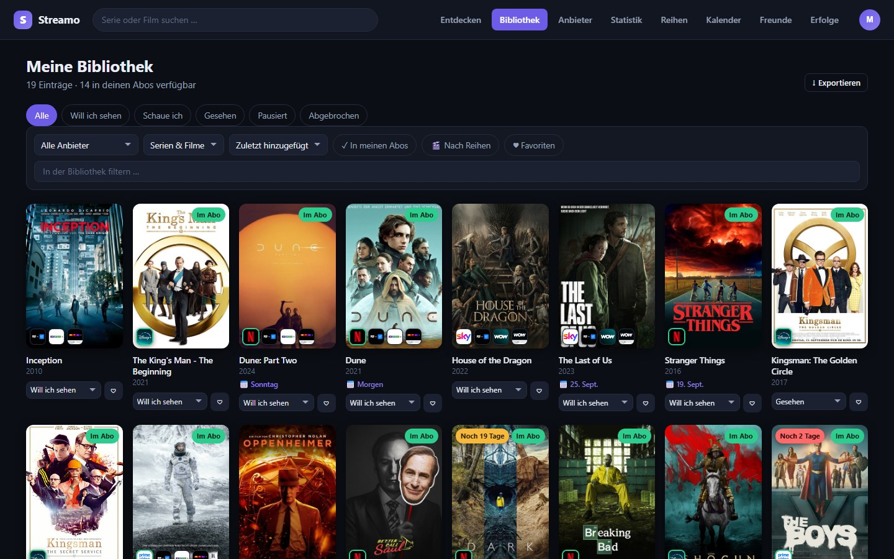
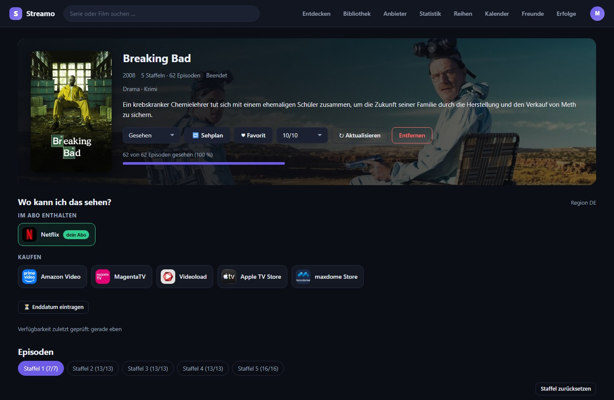
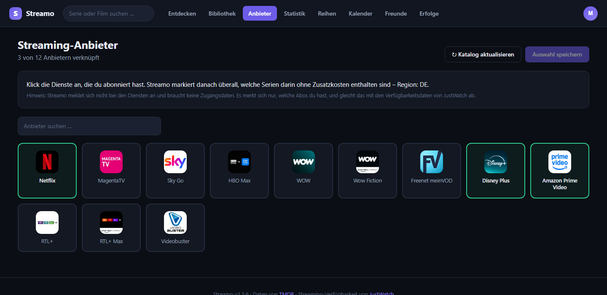
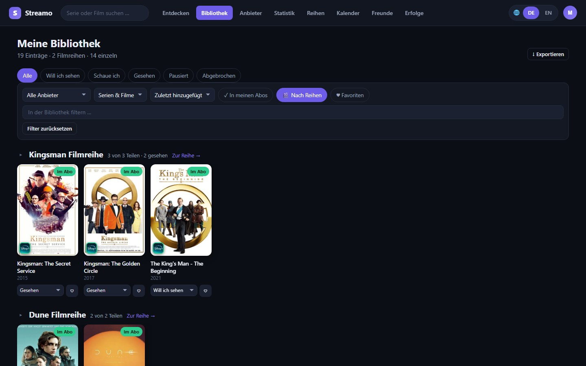
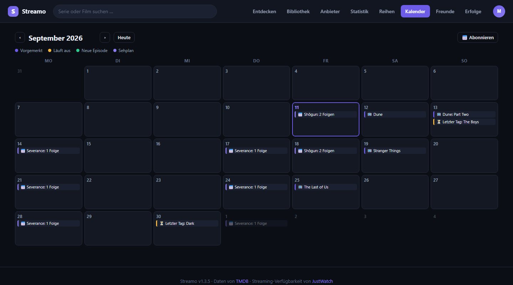
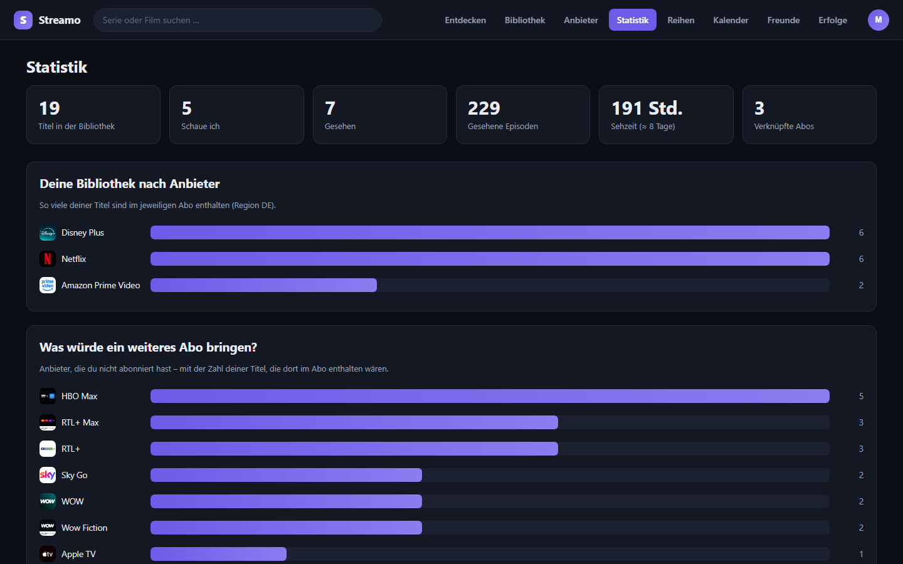
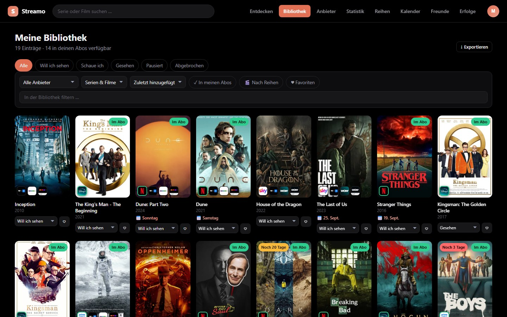
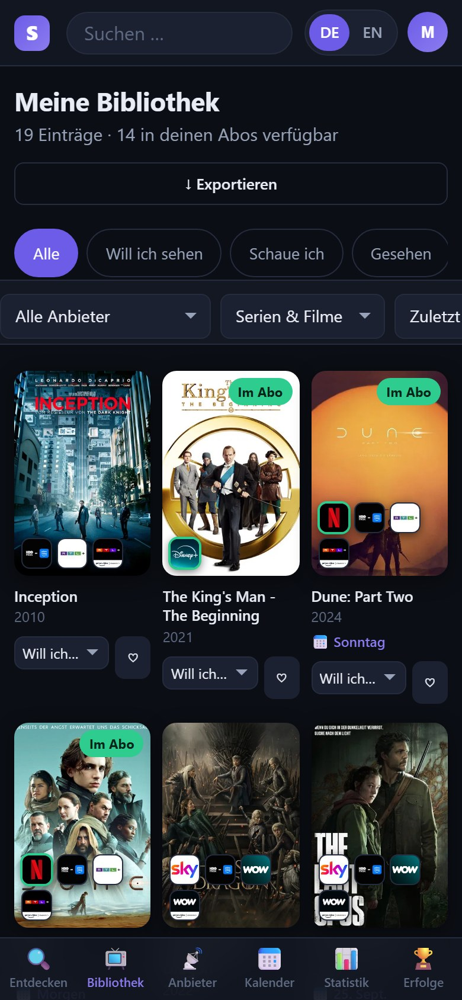
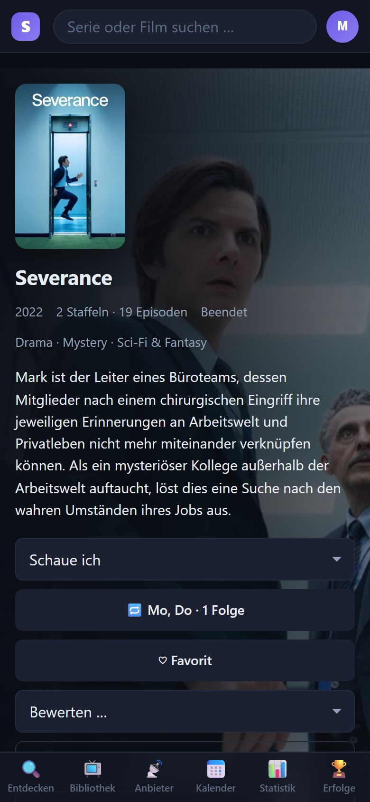
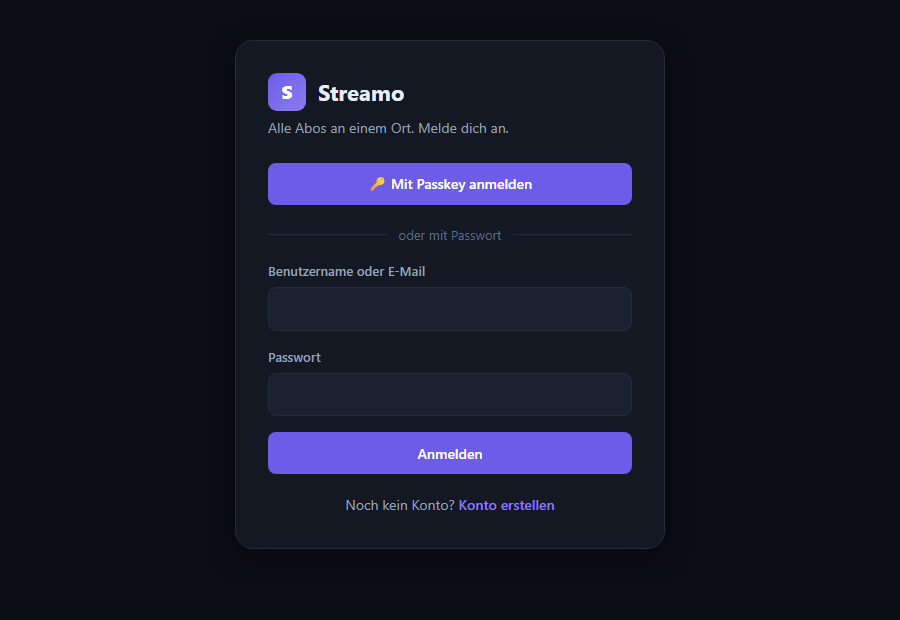

<div align="center">


# Streamo

**Alle Streaming-Abos an einem Ort.**

Deine eigene Serien- und Filmdatenbank, selbst gehostet –<br>
mit einem Blick darauf, **wo** jeder Titel läuft und ob er **in deinem Abo** steckt.

[](https://github.com/MoinMornhart/Streamo/commits/main)
[](LICENSE)
[](https://nodejs.org/)
[](#installation)
[](https://github.com/MoinMornhart/Streamo/releases)

Deutsch · **[English](README.en.md)**

[Installation](#installation) · [Funktionen](#was-streamo-kann) · [Auf dem Handy](#auf-dem-handy) · [Anmelden](#anmelden--passwort-passkey-zwei-faktor) · [Konfiguration](#konfiguration) · [Aktualisieren](#aktualisieren)

<br>



<sub>Alle Bilder zeigen eine Vorführ-Instanz mit Beispieldaten.</sub>

</div>

---

## Auf einen Blick

|  |  |
| --- | --- |
| 📺 **Wo läuft das?** | Bei jedem Titel die Anbieter-Logos, grün umrandet was dein Abo schon abdeckt |
| 📚 **Deine Bibliothek** | Merkliste, Fortschritt je Episode, Bewertungen, Favoriten, Filmreihen |
| 🗓️ **Kalender** | Termine, Sehpläne, auslaufende Angebote – auch als Abo für Apple und Google Kalender |
| 📊 **Auswertung** | Welches Abo sich lohnt, welches du kündigen kannst |
| 👥 **Mehrere Personen** | Eigene Abos und Listen je Person, Freunde, gemeinsame Vorschläge |
| 🔐 **Sicher anmelden** | Passwort, Passkey, Zwei-Faktor mit Authenticator-App |
| 🌍 **Deutsch oder Englisch** | Jede Person wählt die Sprache der Oberfläche, unabhängig von der Sprache der Inhalte |
| 🏠 **Bei dir zu Hause** | Ein Befehl auf Proxmox oder dem Raspberry Pi, keine Zugangsdaten fremder Dienste |

---

## Installation

### Proxmox – ein Befehl

In der **Shell deines Proxmox-Hosts**. Er legt einen LXC-Container an, installiert alles und nennt dir am Ende die Adresse:

```bash
bash -c "$(curl -fsSL https://raw.githubusercontent.com/MoinMornhart/Streamo/main/scripts/streamo.sh)"
```

Nach zwei bis vier Minuten läuft Streamo unter `http://<container-ip>:3000`. Die ausführliche Anleitung mit allen Optionen steht in **[docs/QUICKSTART.md](docs/QUICKSTART.md)**.

<details>
<summary><b>Vorgaben des Containers</b></summary>

<br>

| Vorgabe | Wert |
| --- | --- |
| Betriebssystem | Debian 13 (LXC, unprivilegiert) |
| CPU | 2 Kerne |
| Arbeitsspeicher | 2048 MB |
| Festplatte | 8 GB |
| Netzwerk | DHCP an `vmbr0` |
| Port | 3000 |
| Autostart | ja |

Alle Werte lassen sich im Installationsdialog unter „Erweitert" ändern.

</details>

### Raspberry Pi und andere Linux-Rechner

Es muss kein Proxmox sein. Derselbe Installer läuft auf jedem Debian- oder Ubuntu-System – einschließlich Raspberry Pi OS:

```bash
sudo bash -c "$(curl -fsSL https://raw.githubusercontent.com/MoinMornhart/Streamo/main/scripts/install/streamo-install.sh)"
```

Danach läuft Streamo unter `http://<adresse>:3000`, mit denselben Befehlen (`update`, `streamo status`, …) wie im Container. Er installiert Node.js, legt einen eigenen Dienstbenutzer an und richtet einen systemd-Dienst ein.

> [!TIP]
> **Nimm auf dem Pi die 64-Bit-Fassung.** Streamo braucht Node.js 22.13 oder neuer für das eingebaute `node:sqlite`; auf 32-Bit-Systemen endet die Node-Reihe bei 22, auf 64-Bit gibt es 24. Der Installer wählt die passende von selbst und bricht bei einer Architektur ohne Pakete mit einer klaren Ansage ab, statt später an einer kryptischen `apt`-Meldung zu scheitern.

Die ausführliche Anleitung samt SD-Karten-Sicherung, Speicherbedarf und Fehlersuche steht in **[docs/RASPBERRY-PI.md](docs/RASPBERRY-PI.md)**.

### Von Hand

Voraussetzung: **Node.js 22.13 oder neuer** (wegen des eingebauten `node:sqlite`-Moduls; Node 24 LTS wird empfohlen).

```bash
git clone https://github.com/MoinMornhart/Streamo.git
cd Streamo
npm install --omit=dev
cp .env.example .env      # optional, es geht auch ohne
npm start
```

Streamo läuft dann auf <http://localhost:3000>. Beim ersten Aufruf führt dich ein Assistent durch die Einrichtung.

### Windows-App

Neben der Weboberfläche gibt es eine App für den PC: **[Installer herunterladen](https://github.com/MoinMornhart/Streamo/releases)**

Sie zeigt dieselbe Oberfläche in einem eigenen Programmfenster und kann dazu, was der Browser nicht kann: im Infobereich weiterlaufen, bei neuen Episoden benachrichtigen, mit Windows starten und die Suche per `Strg`+`Umschalt`+`S` öffnen. Ihre Menüs folgen der Sprache des Systems. Details in [desktop/README.md](desktop/README.md).

Die App hält sich selbst aktuell: Sie sieht kurz nach dem Start und danach alle vier Stunden nach, lädt im Hintergrund und fragt dann, ob neu gestartet werden soll. Wer ablehnt, bekommt das Update beim nächsten Beenden. Beim Start leert sie außerdem einmal ihren Zwischenspeicher – sonst könnte sie nach einem Server-Update noch die alte Oberfläche zeigen.

> [!NOTE]
> Auf der Download-Seite steht immer nur die neueste Version; ältere räumt der Bau-Workflow weg. Für die Selbstaktualisierung ist das ohne Belang – sie liest ohnehin immer die neueste.

### Der TMDB-Schlüssel

Streamo holt Titel, Bilder und Verfügbarkeiten über die kostenlose TMDB-API. Dafür brauchst du **einmal** einen Schlüssel: [themoviedb.org/settings/api](https://www.themoviedb.org/settings/api) → Konto anlegen → API beantragen (Verwendungszweck „Personal / Education" genügt) → Schlüssel kopieren. Sowohl der *API Read Access Token* als auch der klassische *API Key* funktionieren. Du trägst ihn beim Einrichten oder später unter *Einstellungen* ein – er gilt dann für die ganze Instanz, eingeladene Personen brauchen keinen eigenen.

---

## Was Streamo kann

### Immer sehen, wo es läuft

Jede Kachel zeigt die Anbieter-Logos direkt auf dem Poster. Grün umrandet heißt: in deinem Abo enthalten. Auf der Detailseite steht die vollständige Aufstellung, getrennt nach Abo, kostenlos, Leihe und Kauf. Ein Klick auf einen Anbieter führt **direkt zu ihm** – zu Netflix, Prime Video, Disney+ und gut einem Dutzend weiterer Dienste, mit der Suche nach dem Titel schon ausgefüllt. Nur für unbekannte Anbieter geht es über JustWatch.



### Anbieter verknüpfen

Klick die Dienste an, die du abonniert hast – Netflix, Disney+, Prime Video, WOW, Paramount+, Apple TV+, MagentaTV und über hundert weitere, je nach Region. Streamo weiß danach, was du ohne Zusatzkosten sehen kannst. Abo-Varianten wie „Netflix Standard with Ads" oder „Paramount+ Amazon Channel" fasst Streamo zu einem Dienst zusammen, statt dich zwischen drei Netflix-Kacheln wählen zu lassen.



### Deine Serien-Datenbank

Suche Serien und Filme und leg sie auf deine Liste. Fünf Zustände (*Will ich sehen, Schaue ich, Gesehen, Pausiert, Abgebrochen*), eigene Bewertung, Favoriten und Notizen.

**Episoden-Fortschritt** – Staffeln und Episoden abhaken, einzeln, staffelweise oder „alles bis hierhin". Der Status wechselt automatisch von *Will ich sehen* auf *Schaue ich* und am Ende auf *Gesehen*.

**Ein Termin, wenn du willst** – Auf der Merkliste lässt sich zu jedem Titel ein Tag eintragen – Freitagabend, das Wochenende, wenn die letzte Staffel erscheint. Freiwillig: Ohne Datum verhält sich die Liste wie bisher. Auf der Kachel steht dann *„Morgen"* oder *„Freitag"*, nach dem Termin *„überfällig"*, und die Bibliothek lässt sich nach *Geplanter Termin* sortieren. Aus einer langen Merkliste wird so eine Reihenfolge statt eines Friedhofs guter Vorsätze. Mit Uhrzeit dazu wird im Kalender ein richtiger Termin daraus: Beim Film endet er nach der Filmlänge, bei einer Serie nach einer Folge.

**Läuft bald aus** – Ist bekannt, bis wann ein Titel bei einem Anbieter läuft, steht es direkt auf der Kachel: *„Noch 5 Tage"*, in den letzten drei Tagen rot. So sieht man beim Überfliegen der Bibliothek, was diese Woche noch drankommen sollte.

> [!NOTE]
> Diese Angabe kommt **nicht** von TMDB. Deren Schnittstelle liefert je Anbieter genau vier Felder – Logo, Kennung, Name und Sortierrang – und kein Enddatum, in keiner Form. Bekannt wird es nur, wenn es jemand einträgt, etwa aus dem Hinweis „Letzter Tag" beim Anbieter. Auf der Detailseite steht dafür *Enddatum eintragen*; der Eintrag gilt dann für alle auf der Instanz, denn wann ein Titel eine Plattform verlässt, ist eine Tatsache über die Plattform. Ist der Tag vorbei und der Titel immer noch da, verschwindet die Angabe von selbst – ein stiller Fehlalarm wäre schlimmer als gar keine Angabe.

### Filmreihen, ein- und ausklappbar

In der Bibliothek lassen sich Titel nach Reihen gruppieren. Eingeklappt belegt eine achtteilige Reihe eine Zeile: drei Kacheln nebeneinander, ein Pfeil rechts blättert weiter. Ausgeklappt steht alles auf einmal da. Welche Reihen offen sind, merkt sich der Browser – genauso wie die zuletzt gesetzten Filter.



**Listen teilen** – Jede Reihe – die eigenen wie die offiziellen von TMDB – lässt sich über einen Link weitergeben, per WhatsApp, Telegram, E-Mail oder einfach kopiert. Wer den Link öffnet, sieht die Liste ohne Konto und ohne Anmeldung. Was der Ersteller gesehen hat und welche Abos er besitzt, steht dort nicht.

### Kalender – auch in deinem eigenen

Ein eigener Reiter mit einem Monatsraster, in dem **jeder** Tag steht – auch die leeren. Genau das macht einen Kalender aus: Man sieht nicht nur, was ansteht, sondern auch, wann nichts ansteht. Eingetragen sind, was du dir vorgenommen hast, deine Sehpläne, was bald eine Plattform verlässt und wann neue Episoden erscheinen.



Das Ganze lässt sich abonnieren – Apple Kalender, Google Kalender, Thunderbird. Einmal einrichten, danach hält es sich von selbst aktuell. Auf dem Mac und dem iPhone genügt ein Klick auf *Jetzt abonnieren*; sonst kopiert man die Adresse in das Kalenderprogramm.

> [!IMPORTANT]
> Die Adresse ist der einzige Nachweis – ein Kalenderprogramm kann sich nicht anmelden. Sie ist damit so schutzbedürftig wie ein Passwort und lässt sich jederzeit neu erzeugen, wodurch alte Abonnements ins Leere laufen.

### Streamo × ToDoch

[ToDoch](https://github.com/MoinMornhart/ToDoch) – die selbst gehostete To-do- und Kalender-App – übernimmt diesen Kalender automatisch: Abo-Adresse hier kopieren und in ToDoch unter **Bereiche → Kalender einbinden** einfügen. Ab dann steht jeder geplante Film, jeder Sehplan und jede neue Folge im ToDoch-Kalender, im Hintergrund abgeglichen (alle 15 Minuten bis täglich). Geändert wird in Streamo – ToDoch zieht nach.

### Sehplan – jeden Montag zwei Folgen

So schaut man Serien tatsächlich: nicht irgendwann, sondern in einem Rhythmus. Stell bei einer Serie ein, an welchen Tagen du sie siehst und wie viele Folgen – Streamo hakt sie an diesen Tagen selbst ab.

Der Plan merkt sich dabei **nicht**, wo er steht, sondern nimmt jedes Mal die nächsten ungesehenen Folgen. Wer an einem Abend spontan fünf Folgen schaut und von Hand abhakt, bekommt am nächsten Montag nicht dieselben noch einmal – der Plan macht dort weiter, wo du bist. Specials und noch nicht ausgestrahlte Folgen bleiben außen vor.

War der Server an einem Plantag aus, wird nachgeholt – gedeckelt auf drei Termine, damit nach dem Urlaub nicht eine halbe Staffel als gesehen dasteht. Die kommenden Termine stehen im Kalender.

**Mit Uhrzeit** – Wer mag, gibt dazu an, wann geschaut wird: „montags um 20:15“. Dann steht jeder Termin mit Anfang und Ende im Kalender, auch im abonnierten. Wie lange er geht, rechnet Streamo aus der Länge genau der Folgen aus, die dran sind – zwei Folgen à 50 Minuten ergeben 20:15 bis 21:55, ein Abend mit dem Staffelfinale wird entsprechend länger. Abgehakt wird dann erst, wenn der Termin vorbei ist.

### Auswertung, die eine Frage beantwortet

Wie verteilen sich deine Serien auf die Abos? Bei welchem Dienst läuft nichts von deiner Liste (Kündigungskandidat)? Welches zusätzliche Abo würde dir am meisten freischalten? Und wie viel Lebenszeit hast du eigentlich investiert?



### Entdecken statt suchen

Die Startseite zeigt zwei Bestenlisten: die **Top-Filme der Woche** – was gerade am meisten gesehen wird – und die **Top-Filme des Jahres**, nach Bewertung sortiert und ab 500 Stimmen, damit kein Zufallstreffer mit vier Bewertungen ganz oben steht. Wo ein Titel läuft und ob er in einem deiner Abos steckt, zeigen die Anbieter-Logos auf der Kachel.

**Für dich – Empfehlungen aus der eigenen Bibliothek.** Über den populären Titeln steht eine Leiste, die für jede Person anders aussieht. Sie entsteht aus dem, was du selbst gesehen hast: Eine 10 von 10 zählt mehr als eine 6, ein Favorit mehr als ein Nebenbei-Titel, eine durchgesehene Serie mehr als eine angefangene. Was auf der Merkliste liegt, zählt nicht – gesehen hast du es ja noch nicht; Abgebrochenes und schlecht Bewertetes ebenso wenig. Jede Kachel sagt, warum sie da ist: *„Weil du Breaking Bad gesehen hast."*

**Suche, die Tippfehler verzeiht.** „Kingsmann" findet *Kingsman*, „Braking Bad" findet *Breaking Bad*, „spiderman" findet *Spider-Man*. Umlaute und Akzente sind egal. Bringt die Suche bei TMDB nichts, fasst Streamo mit bereinigten Schreibweisen nach und sagt dazu, wonach es tatsächlich gesucht hat.

### Automatischer Abgleich

Streamo prüft **stündlich**, wo deine Serien inzwischen laufen. Streaming-Rechte wandern ständig – du merkst es, ohne nachzusehen. Abgeglichen wird nur, was tatsächlich in einer Bibliothek steht; bei 300 Titeln sind das rund 20 Sekunden Arbeit pro Durchgang. Den Takt stellst du unter *Einstellungen → Abgleich* ein, von stündlich bis „gar nicht" – die Änderung gilt sofort, ohne Neustart.

### Mehrere Personen und Freunde

Optional. Jede Person hat eigene Abos, eigene Bibliothek, eigenen Fortschritt und eigene Region. Wer sie einlädt, sieht unter *Einstellungen → Benutzer*, wer ein Konto hat, wann er zuletzt da war und ob gerade jemand angemeldet ist – und kann dort Adminrechte vergeben oder ein Konto löschen.

> [!WARNING]
> Beim Löschen verschwindet alles, was an dem Konto hängt: Bibliothek, Sehfortschritt, Abos, Bewertungen, Erfolge, Passkeys, Freundschaften und eigene Filmreihen. Deshalb muss der Benutzername zur Bestätigung abgetippt werden. Verschickte Einladungen bleiben gültig – sie gehören zur Instanz, nicht zur Person. Das eigene Konto und der letzte Administrator lassen sich nicht löschen.

**Freunde** – Seht euch gegenseitig die Listen an und lasst Streamo ausrechnen, was ihr *zusammen* schauen könnt: auf Grundlage eurer beider Abos und dessen, was ihr euch vorgenommen habt. Dazu Empfehlungen mit einem Satz Begründung – das ist der Unterschied zwischen „schau dir das an" und einem Link.

### Deutsch oder Englisch

Jede Person stellt unter *Einstellungen → Konto* die Sprache der Oberfläche ein – Menüs, Knöpfe, Meldungen und das Kalender-Abo folgen ihr, auf allen Geräten. Umgeschaltet wird mit einem Klick: In der Kopfzeile steht neben dem Kontokreis **🌐 DE | EN**, auf jeder Seite und auch auf dem Handy – ebenso oben rechts auf dem Anmeldebildschirm. Davon getrennt bleibt die *Sprache der Inhalte*: Englische Oberfläche mit deutschen Serientiteln und Beschreibungen geht genauso.

Die Windows-App richtet ihr Tray-Menü und ihre Meldungen nach der Sprache des Systems.

### Dein Farbschema

Streamo war violett, weil sich irgendjemand einmal für Violett entscheiden musste. Jede Person wählt ihre eigene Akzentfarbe – acht Vorgaben oder ein freier Farbwähler – und dazu einen Grundton: Dunkelblau oder echtes Schwarz. Die Einstellung gilt für dein Konto, nicht für die ganze Instanz, und reist zu deinen anderen Geräten mit.



---

## Auf dem Handy

Dieselbe Oberfläche, fürs Telefon eingerichtet: die Reiter wandern in eine Leiste am unteren Rand, Felder sind groß genug für den Daumen, und iOS zoomt beim Antippen nicht mehr in die Eingabefelder hinein. Auf den Home-Bildschirm gelegt, sieht Streamo aus wie eine App.

<p align="center">
  
  &nbsp;&nbsp;&nbsp;
  
</p>

---

## Woher kommen die Daten?

Streamo meldet sich **nicht** bei Netflix, Disney+ und Co. an und braucht **keine Zugangsdaten** fremder Dienste. Solche Schnittstellen gibt es nicht öffentlich, und Passwörter anderer Anbieter gehören nicht in eine selbst gehostete Anwendung.

Stattdessen:

1. Du hinterlegst **welche Abos du hast** (ein Klick pro Dienst).
2. Streamo holt die **Verfügbarkeitsdaten von JustWatch** – über die kostenlose TMDB-API. Das ist dieselbe Quelle, die auch die großen Vergleichsportale nutzen.
3. Beides wird abgeglichen: Du siehst bei jedem Titel, wo er läuft und ob er in *deinem* Abo drin ist.

Das Ergebnis ist dasselbe, nur ohne Passwort-Weitergabe.

---

## Anmelden – Passwort, Passkey, Zwei-Faktor



Drei Wege, die nebeneinander bestehen:

| Weg | Womit |
| --- | --- |
| Benutzername + Passwort | funktioniert immer, überall |
| E-Mail + Passwort | die E-Mail ist optional, nur ein zweiter Anmeldename |
| **Passkey** | Windows Hello, Face ID, Fingerabdruck oder Sicherheitsschlüssel |

Bei einem Passkey entsteht ein Schlüsselpaar auf deinem Gerät. Der private Teil verlässt es nie – Streamo speichert nur den öffentlichen. Selbst wer die gesamte Datenbank stiehlt, kann sich damit nicht anmelden.

Eingerichtet werden Passkeys unter *Einstellungen → Passkeys*. Du kannst mehrere anlegen (Rechner, Handy, Sicherheitsschlüssel) und danach optional das Passwort entfernen – Streamo lässt das nur zu, solange mindestens ein Passkey übrig bleibt.

<br clear="right">

> [!NOTE]
> **Streamo verschickt keine E-Mails** und braucht keinen Mailserver. Die Adresse ist ausschließlich ein zweiter Anmeldename.

### Ein Konto anlegen

| Weg | Wann |
| --- | --- |
| Einrichtungsassistent | einmalig, beim allerersten Start – dieses Konto wird Administrator |
| Einladungs**link** | einfach öffnen, Name und Passwort eintragen, fertig |
| *Konto erstellen* auf dem Anmeldebildschirm | mit dem Einladungs**code**, oder ganz ohne, wenn die Registrierung offen steht |

Ob ein Code nötig ist, entscheidet die Instanz. Standardmäßig ja – siehe [Konfiguration](#konfiguration). Umschalten kannst du das unter *Einstellungen → Freunde einladen* oder mit `streamo registration offen`.

Wer eingeladen wird, braucht **keinen eigenen TMDB-Zugang**: Der gilt für die ganze Instanz und ist längst hinterlegt. Genau deshalb gibt es Einladungen – sonst müsste sich jeder erst bei einer Filmdatenbank anmelden und dort seine Adresse angeben.

### Zwei-Faktor-Anmeldung

Zusätzlich zum Passwort ein sechsstelliger Code aus einer Authenticator-App – Aegis, 2FAS, Google Authenticator oder was auch immer TOTP beherrscht. Selbst wer dein Passwort kennt, kommt damit nicht in dein Konto.

Streamo verschickt dafür nichts und ruft nichts ab. Server und App teilen sich beim Einrichten ein Geheimnis und rechnen danach unabhängig voneinander dasselbe aus – das funktioniert auch im Flugmodus. Das Verfahren ist TOTP nach RFC 6238; die Umsetzung in `src/totp.js` wird gegen die offiziellen Testvektoren der Norm geprüft (`npm run test:totp`).

Eingerichtet wird das unter *Einstellungen → Zwei-Faktor-Anmeldung*, in zwei Schritten: Erst bekommt die App das Geheimnis, dann muss ein gültiger Code beweisen, dass sie es wirklich hat. Ohne diesen Beweis könnte man sich beim Übertragen vertun und wäre anschließend ausgesperrt.

Dazu gibt es zehn **Ersatzcodes**. Sie erscheinen genau einmal – danach liegen nur noch ihre Prüfsummen in der Datenbank, niemand kann sie erneut anzeigen, auch der Betreiber nicht. Bewahre sie auf: Weil Streamo keine E-Mails verschickt, gibt es ohne sie keinen Weg zurück, wenn das Telefon verloren geht. Jeder Code gilt einmal.

Passkeys brauchen keinen zweiten Faktor – sie sind selbst schon zwei (das Gerät plus Fingerabdruck oder PIN) und werden deshalb nicht zusätzlich nach einem Code gefragt.

### Voraussetzungen für Passkeys

Passkeys brauchen HTTPS und einen Hostnamen – über eine nackte IP-Adresse gehen sie grundsätzlich nicht.

<details>
<summary><b>So erfüllst du das – mit Reverse Proxy oder eigenem HTTPS</b></summary>

<br>

Zwei Regeln setzt der Browser, an denen sich nichts ändern lässt:

1. **HTTPS ist Pflicht.** Über `http://` funktionieren Passkeys nicht (Ausnahme: `localhost`).
2. **Ein Hostname ist Pflicht.** Eine IP-Adresse ist nicht erlaubt – `https://192.168.1.50:3000` scheidet also aus.

Sind sie nicht erfüllt, blendet Streamo den Passkey-Knopf aus und nennt auf der Einstellungsseite den Grund. Der Passwortweg bleibt in jedem Fall.

**Mit Reverse Proxy und eigener Domain** (empfohlen): Nginx Proxy Manager, Traefik o. Ä. mit Let's-Encrypt-Zertifikat, Ziel `http://<container-ip>:3000`. Danach im Container **einen Befehl**:

```bash
streamo domain streamo.deine-domain.de
```

Der trägt `TRUST_PROXY`, `WEBAUTHN_RP_ID` und `WEBAUTHN_ORIGIN` ein und startet den Dienst neu. Nötig ist er, weil viele Proxys den `Host`-Header nicht durchreichen, sondern ihre eigene Adresse schicken – Streamo sähe dann eine IP statt deiner Domain und würde Passkeys ablehnen. Die Einstellungsseite zeigt dir unter *Passkeys*, welche Adresse Streamo tatsächlich wahrnimmt.

**Ohne Proxy, mit eigenem HTTPS**: `ENABLE_HTTPS=true` und `TLS_HOSTNAME=streamo.local` in der `.env`. Streamo erzeugt dann ein selbstsigniertes Zertifikat, und der HTTP-Port leitet auf HTTPS um. Im Browser musst du das Zertifikat einmal bestätigen – die Desktop-App akzeptiert es auf Wunsch ohne Rückfrage.

> [!CAUTION]
> Ziehst du Streamo später auf eine andere Domain um, werden alle Passkeys ungültig. Das ist kein Fehler, sondern genau der Mechanismus, der Passkeys phishing-sicher macht: Sie sind fest an eine Domain gebunden. Das Passwort funktioniert weiterhin.

</details>

---

## Konfiguration

Alle Werte stehen in `.env` (Vorlage: [`.env.example`](.env.example)). Jeder hat eine sinnvolle Vorgabe – eine leere Datei funktioniert.

| Variable | Vorgabe | Bedeutung |
| --- | --- | --- |
| `PORT` | `3000` | Port der Weboberfläche |
| `HOST` | `0.0.0.0` | Bind-Adresse; `127.0.0.1` = nur lokal |
| `DATA_DIR` | `./data` | Speicherort der SQLite-Datenbank |
| `SESSION_SECRET` | *(automatisch)* | Signatur der Anmeldesitzungen |
| `TMDB_API_KEY` | – | Dein TMDB-Schlüssel; auch im UI setzbar |
| `STREAMO_REGION` | `DE` | Land, für das die Verfügbarkeit gilt |
| `STREAMO_LANGUAGE` | `de-DE` | Sprache von Titeln und Beschreibungen |
| `SYNC_INTERVAL_HOURS` | `1` | Startvorgabe für den Abgleichstakt in Stunden; `0` = aus. In der Oberfläche änderbar, der dort gesetzte Wert gewinnt. |
| `ALLOW_REGISTRATION` | `false` | Dürfen sich weitere Personen ohne Einladung registrieren? |
| `TRUST_PROXY` | `false` | `true`, wenn ein HTTPS-Proxy davorsteht |

Nach Änderungen: `systemctl restart streamo`

> [!IMPORTANT]
> `ALLOW_REGISTRATION` steht mit Absicht auf `false`: Sobald Streamo aus dem Internet erreichbar ist, könnte sonst jeder, der die Adresse findet, ein Konto anlegen – und deinen TMDB-Zugang mitbenutzen. Der Normalfall ist deshalb die Einladung.
>
> Umschalten lässt sich das auch ohne Server-Zugang, unter *Einstellungen → Freunde einladen* oder mit `streamo registration offen`. Der so gespeicherte Wert sticht die `.env`.

---

## Aktualisieren

Im Container genügt ein Wort:

```bash
update
```

Vom Proxmox-Host aus, ohne sich einzuloggen:

```bash
pct exec <CTID> -- update
```

Was dabei passiert:

1. Nachsehen, ob es überhaupt eine neue Version gibt – wenn nicht, ist nach einer Sekunde Schluss
2. Die Änderungen der neuen Version anzeigen und einmal nachfragen
3. Sicherungskopie der Datenbank anlegen (die letzten fünf bleiben erhalten)
4. Dienst anhalten, neue Version holen, Abhängigkeiten installieren
5. Dienst starten und prüfen, ob er wirklich antwortet
6. **Antwortet er nicht, wird automatisch der vorherige Stand wiederhergestellt** – Code und Datenbank. Streamo läuft dann in der alten Version weiter, statt kaputt liegenzubleiben.

Deine Datenbank (`data/`) und deine Konfiguration (`.env`) bleiben in jedem Fall unberührt.

| Befehl | Wirkung |
| --- | --- |
| `update` | Aktualisieren, mit Rückfrage |
| `update --check` | Nur nachsehen, ob es etwas Neues gibt. Ändert nichts. |
| `update --yes` | Ohne Rückfrage – für Cronjobs und Automatisierung |
| `update --force` | Auch bei aktueller Version neu installieren (Reparatur) |

`streamo-update` ist derselbe Befehl unter sprechendem Namen.

<details>
<summary><b>Weitere Befehle im Container</b></summary>

<br>

```bash
streamo                    # zeigt alle Befehle
streamo status             # Läuft der Dienst?
streamo logs               # Protokoll live mitlesen
streamo restart            # Neu starten
streamo config             # .env bearbeiten, startet danach automatisch neu
streamo domain <d>         # Domain eintragen – nötig für Passkeys hinter einem Proxy
streamo admin <name>       # Adminrechte vergeben (ohne Namen: alle Konten auflisten)
streamo registration offen # Konto ohne Einladung erlauben (oder: zu)
streamo backup             # Datenbank und Konfiguration sichern
streamo info               # Version, Adresse, Zustand
```

Beim Anmelden im Container begrüßt dich eine Übersicht mit Version, Adresse und Dienstzustand.

`streamo admin` und `streamo registration` lösen ein Henne-Ei-Problem: Adminrechte bekommt automatisch nur das allererste Konto aus dem Einrichtungsassistenten, und den Schalter für die offene Registrierung sehen nur Administratoren. Wer später über eine Einladung dazugekommen ist, käme also an beides nicht heran.

`streamo admin` ohne Namen listet alle Konten mit ihrem Rang. Der letzte Administrator kann sich nicht selbst entmachten – sonst könnte niemand mehr den TMDB-Zugang ändern oder Einladungen erzeugen.

</details>

<details>
<summary><b>Automatisch aktualisieren (nachts per Cron)</b></summary>

<br>

```bash
pct exec <CTID> -- bash -c "echo '30 4 * * * root /usr/local/bin/update --yes >/var/log/streamo-update.log 2>&1' > /etc/cron.d/streamo-update"
```

Durch den automatischen Rollback ist das ungefährlich: Sollte ein Update den Dienst lahmlegen, steht am Morgen wieder die funktionierende Vorversion.

</details>

---

## Datensicherung

Alles Wichtige liegt in einem Verzeichnis:

```bash
# Sicherung
cp -r /opt/streamo/data ~/streamo-backup

# In der Oberfläche: Einstellungen → Daten → Bibliothek exportieren
# ergibt eine JSON-Datei mit Bibliothek, Abos und Fortschritt.
```

Der Container lässt sich natürlich auch klassisch über die Proxmox-Sicherung (vzdump) sichern.

---

## Fehlersuche

<details>
<summary><b>Die Oberfläche ist nicht erreichbar</b></summary>

<br>

```bash
pct exec <CTID> -- systemctl status streamo
pct exec <CTID> -- journalctl -u streamo -n 50
```

</details>

<details>
<summary><b>Suche liefert nichts / Anbieterliste ist leer</b></summary>

<br>

Meistens fehlt der TMDB-API-Key oder er ist falsch. *Einstellungen → TMDB-Zugang → Schlüssel testen* sagt dir, woran es liegt.

</details>

<details>
<summary><b>Es werden die falschen Anbieter angezeigt</b></summary>

<br>

Prüfe deine Region unter *Einstellungen → Konto*. Sie entscheidet, welcher Länder-Katalog und welche Verfügbarkeiten gelten.

</details>

<details>
<summary><b>Verfügbarkeit wirkt veraltet</b></summary>

<br>

*Einstellungen → Abgleich → Verfügbarkeit abgleichen* stößt den Lauf sofort an. Auf der Detailseite gibt es dafür den Knopf *Aktualisieren*.

</details>

---

## Für Entwickler

<details>
<summary><b>Aufbau des Projekts</b></summary>

<br>

```
Streamo/
├── src/                    Server (Node.js + Express)
│   ├── server.js           Einstiegspunkt, Middleware, Routen einhängen
│   ├── config.js           Konfiguration aus .env
│   ├── db.js               SQLite-Schema und Zugriffs-Helfer
│   ├── auth.js             Passwörter (scrypt), Sessions, Zugriffsschutz
│   ├── passkeys.js         WebAuthn – Anmelden ohne Passwort
│   ├── totp.js             Einmalcodes nach RFC 6238 (zweiter Faktor)
│   ├── twofactor.js        Ersatzcodes und halbfertige Anmeldungen
│   ├── tmdb.js             TMDB-Client inkl. Verfügbarkeitsdaten
│   ├── store.js            Brücke zwischen TMDB und Datenbank
│   ├── providers-canonical.js  Abo-Varianten zu einem Dienst zusammenfassen
│   ├── sync.js             Hintergrundabgleich
│   ├── calendar.js         Kalender und iCalendar-Abo
│   ├── watchplan.js        Sehpläne – automatisch abhaken
│   ├── fuzzy.js            Suche, die Tippfehler verzeiht
│   ├── quicksearch.js      Eine Suche über Reihen, Freunde und Leute
│   ├── recommend.js        "Für dich" – Vorschläge aus der eigenen Bibliothek
│   ├── collections.js      Filmreihen, eigene wie offizielle
│   ├── friends.js          Freundschaften und gemeinsames Schauen
│   ├── achievements.js     Erfolge
│   ├── invites.js          Einladungslinks
│   └── routes/             Die API, ein Modul je Bereich
├── public/                 Frontend – reine ES-Module, kein Build nötig
│   ├── index.html
│   ├── css/styles.css
│   └── js/
│       ├── api.js          Der einzige Weg zum Server
│       ├── ui.js           Bausteine (Poster-Kachel, Dialoge, Formatierer)
│       ├── i18n.js         Deutsch oder Englisch – übersetzt an einer Stelle
│       ├── i18n/           Das englische Wörterbuch
│       ├── theme.js        Akzentfarbe und Grundton
│       ├── provider-links.js  Direktlinks zu den Anbietern
│       ├── router.js       Routing über die Adressleiste
│       ├── app.js          Einstiegspunkt, globaler Zustand
│       └── views/          Eine Datei je Ansicht
├── desktop/                Die Windows-App (Electron)
├── scripts/
│   ├── streamo.sh          Proxmox-Installer (LXC anlegen)
│   ├── streamo-update.sh   Update mit Rollback
│   ├── make-admin.mjs      Adminrechte auf der Konsole vergeben
│   ├── registration.mjs    Offene Registrierung ein- und ausschalten
│   └── install/            Installation im Container und auf dem Pi
├── tests/                  Über 600 Prüfungen, ohne Test-Framework
└── docs/                   Anleitungen (Proxmox, Raspberry Pi) und Bilder
```

Der gesamte Code ist durchgehend auf Deutsch kommentiert – jede Verknüpfung zwischen Tabellen, Endpunkten und Ansichten ist an Ort und Stelle erklärt.

</details>

<details>
<summary><b>Technische Entscheidungen</b></summary>

<br>

- **Zwei npm-Abhängigkeiten**: `express` und `@simplewebauthn/server`. Passwort-Hashing, Sessions, `.env`-Parsing und der Cookie-Umgang sind mit Bordmitteln von Node gelöst. Die Ausnahme sind Passkeys – bei WebAuthn selbst geschriebene Kryptografie wäre fahrlässig.
- **Der zweite Faktor dagegen ist selbst geschrieben** (`src/totp.js`), und das ist kein Widerspruch: Hier gibt es nichts zu erfinden. `node:crypto` liefert HMAC-SHA1 fertig, der Rest ist Byte-Schieberei nach einer klar beschriebenen Norm – und RFC 6238 bringt offizielle Testvektoren mit, gegen die `npm run test:totp` prüft.
- **SQLite über `node:sqlite`** – in Node eingebaut und ab Version 22.13 ohne Zusatzschalter nutzbar. Keine native Kompilierung, kein Datenbankserver. Die gesamte Installation ist eine Datei plus ein Verzeichnis.
- **Kein Frontend-Build.** Die Oberfläche besteht aus nativen ES-Modulen. Kein Webpack, kein `npm run build`, kein Bundle – Dateien kopieren genügt.
- **Übersetzung, ohne die Ansichten umzuschreiben.** Der deutsche Text im Code ist selbst der Schlüssel; `el()` in `ui.js` übersetzt beim Bauen der Elemente. Fehlt ein Eintrag, bleibt es deutsch – kaputt gehen kann dabei nichts, und bei Deutsch ist die Übersetzung ganz abgeschaltet.
- **Kein Test-Framework.** Die Tests unter `tests/` sind gewöhnliche Skripte, die etwas tun und das Ergebnis vergleichen. `npm run test:all` führt sie alle aus. Über 600 Prüfungen, keine einzige Abhängigkeit dafür.
- **Alle Filter stehen in der URL.** Jede Ansicht der Bibliothek ist verlinkbar, der Zurück-Knopf funktioniert. Die zuletzt benutzten merkt sich der Browser zusätzlich.
- **Keine Browser-Dialoge.** Kein `prompt()`, kein `confirm()` – alle Fenster sind Teil der Oberfläche und tragen deine Akzentfarbe.

</details>

---

## Hinweise

Dieses Produkt verwendet die TMDB-API, ist aber weder von TMDB unterstützt noch zertifiziert. Die Streaming-Verfügbarkeit stammt von JustWatch. Poster und Szenenbilder in den Bildschirmfotos stammen von TMDB.

Streamo speichert keine Zugangsdaten fremder Dienste und stellt keine Inhalte bereit – es zeigt lediglich, wo Inhalte legal verfügbar sind.

## Lizenz

MIT – siehe [LICENSE](LICENSE).
